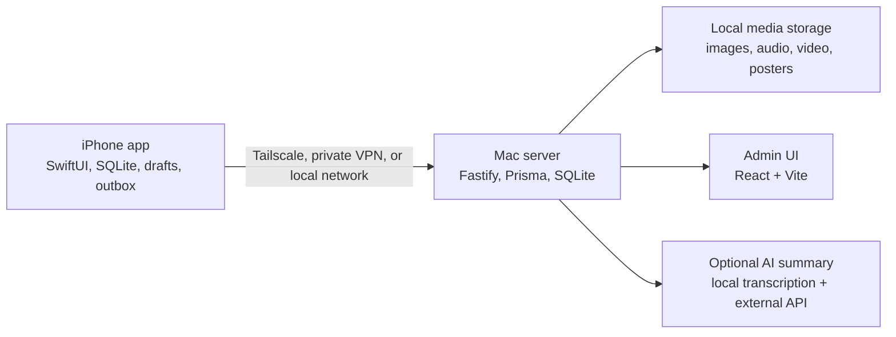

# Private Moments

[中文版本](README.md)

## A private social feed for a life that does not need an audience.

Private Moments is an iPhone-first, Mac-hosted personal timeline for text, photos, voice notes, short videos, and the small comments you want to leave under your own memories.

It is built for the moment when a diary feels too formal, a notes app feels too fragmented, and a social network feels like performing. You post with the lightness of a social feed, but everything stays in your own local-first system: captured on iPhone, synced to your Mac, backed up by you, and reachable over your private network.

No followers. No engagement loop. No rented cloud archive.

Just your moments, in a feed that belongs to you.

## Screenshots

The screenshots below use demo data and show the core iOS experience.

<table>
  <tr>
    <td width="25%">
      <br>
      <sub>Timeline: text, audio, comments, and AI-summary entry points stay in one feed.</sub>
    </td>
    <td width="25%">
      <br>
      <sub>AI Summary: long audio and video media can become structured summaries.</sub>
    </td>
    <td width="25%">
      <br>
      <sub>Search: find older moments by text, comments, transcripts, and summary matches.</sub>
    </td>
    <td width="25%">
      <br>
      <sub>Diagnostics: inspect local storage, sync state, and upload health on iPhone.</sub>
    </td>
  </tr>
</table>

## Latest Update: Faster Capture, Smarter Recall

This public snapshot now includes the latest product iteration. The goal is still a quiet timeline; the new work mainly reduces friction around capture and later organization:

- **Save to Moments Share Extension**
  Send photos, videos, audio files, text, or links from the iOS Share Sheet into Moments. The main app opens the existing Composer so you can edit, reorder, add text, and publish normally.

- **Smart Tags**
  Moments can have a small set of primary tags plus dynamic topic tags, aliases, archive/restore/delete, and batch management. New audio moments can receive conservative AI-suggested tags after the first ready AI summary. Image, video, and plain-text moments are not auto-tagged by AI.

- **AI Summary v3 and AI Titles**
  New media summaries use a structured document-block model. For new audio moments without a handwritten title, the generated short title can be inserted at the top of the moment text. Only the title is inserted; the summary body stays generated metadata.

- **Quieter Feature Toggles**
  Settings now includes feature toggles for timeline tags and AI title insertion, plus System / Light / Dark appearance control. The main timeline remains intentionally low-noise.

## Why This Exists

Most personal-memory tools push you toward one of two uncomfortable shapes:

- **Social apps** are easy to post to, but the default context is other people.
- **Diary and knowledge-base apps** are private, but they often turn everyday life into a writing task or a database chore.

Private Moments tries to sit in the middle:

- fast enough for a sentence, a meal photo, a voice memo, or a short video;
- private enough that there is no audience in your head;
- structured enough that you can actually find, filter, summarize, and back up the archive later;
- local-first enough that recording your life does not depend on a remote service being available.

The guiding idea is simple: **capture like posting, keep like archiving**.

## What It Does

- **Personal timeline**
  Create text, image, audio, video, or text-plus-media moments from iPhone, then browse them as a calm chronological feed.

- **Private comments**
  Add lightweight comments directly under a moment, similar to the rhythm of a private Moments-style feed, without introducing other users, likes, replies, or notifications.

- **System Share Sheet capture**
  Use `Save to Moments` from other iOS apps to bring external material directly into the Moments Composer.

- **Offline-first capture**
  Posts appear locally immediately. Sync work is queued and retried when the Mac server becomes reachable again.

- **Mac-owned archive**
  A self-hosted Mac server stores SQLite metadata, media files, sync state, logs, and the admin dashboard.

- **Media-aware experience**
  Images are compressed for practical storage, videos get poster thumbnails and muted timeline playback, and audio records as local voice notes.

- **AI summaries for long media**
  Uploaded audio and video can be transcribed on the Mac and summarized through an external OpenAI-compatible API. New audio can also receive an AI-generated short title in the moment body. The iPhone never stores the provider API key.

- **Smart Tags**
  Add manual primary tags and topic tags, or let new audio moments receive conservative AI tag suggestions after a ready summary. Tags can stay hidden from the timeline, and Settings includes color, alias, archive, merge, and delete tools.

- **Search and organization**
  Timeline search supports lightweight fuzzy matching, media-type filters, month filters, favorites, comments, tags, pending sync state, and match-source filters.

- **Diagnostics and recovery**
  Storage, sync, upload, and AI-summary health can be inspected from the app and admin tools. Local backup, restore, and metadata export commands are included.

## How It Is Different

| Compared with | Private Moments is different because |
| --- | --- |
| WeChat Moments, Instagram, or other social feeds | It keeps the easy posting rhythm, but removes audience, algorithms, likes, public comments, and platform lock-in. |
| Apple Notes or Voice Memos | It gives scattered text, photos, recordings, and videos one chronological home instead of leaving them as separate app silos. |
| Diary apps | It does not require a polished daily entry. A single line, a clip, or a follow-up comment is enough. |
| Cloud journal products | The long-term archive lives on your Mac and can be backed up with your own tools. |
| Photo backup galleries | It is not just a media dump. It keeps text context, comments, occurred time, favorites, search, and AI summaries around each moment. |
| Notion, Obsidian, or knowledge-base systems | It is optimized for capture and revisiting life, not building a second workspace. |

## Current Status

This repository is a **v1.0 public-release candidate**.

It is already useful as a local personal system if you are comfortable running a Mac server and installing an iOS app from source. It is not yet packaged as an App Store/TestFlight product, and the public release still expects developer-style setup.

Included today:

- native SwiftUI iOS app;
- Node.js/Fastify Mac server;
- Prisma + SQLite metadata store;
- local media storage;
- React/Vite admin UI;
- sync API and OpenAPI contract;
- text, images, audio, video, Share Sheet imports, comments, favorites, filters, and search;
- Smart Tags, tag management, and tag-aware search;
- AI media summaries with Mac-local transcription plus external summary provider, AI tag suggestions, and AI title auto-insert;
- backup, restore, export, diagnostics, and launchd service scripts.

## Architecture



The iPhone is the capture and browsing surface. The Mac is the archive, sync peer, media store, diagnostics surface, and optional AI worker.

The intended network boundary is a private network such as Tailscale or another VPN. Do not expose the server directly to the public internet without adding your own production hardening.

The Share Extension uses an iOS App Group to hand temporary imports from the extension to the main app. The public defaults are `dev.privatemoments.app` and `group.dev.privatemoments.app`; for real-device signing, configure the matching capability in your Apple Developer account or replace the identifiers with your own.

## Quick Start

Requirements:

- macOS;
- Node.js and npm;
- Xcode for iOS builds;
- XcodeGen for regenerating the iOS project;
- optional: Tailscale or another private VPN for real-device use away from the Mac;
- optional: `mlx-whisper` environment and an OpenAI-compatible API provider for AI summaries.

After cloning the repository:

```bash
npm run setup:local
npm run server:dev
```

The server defaults to:

```text
http://127.0.0.1:3210
```

After the admin UI is built, it is served at:

```text
http://127.0.0.1:3210/admin/
```

The setup script creates local configuration when needed, installs dependencies, prepares Prisma, applies database migrations, builds the admin UI, and builds the server.

Optional setup flags:

```bash
npm run setup:local -- --with-ai
npm run setup:local -- --with-ios
```

Use `--with-ai` when you want Mac-local transcription support for audio/video summaries. Use `--with-ios` when you want the setup script to regenerate the iOS project.

## iOS App

Run in the simulator:

```bash
npm run ios:simulator
```

Install on a paired iPhone:

```bash
PRIVATE_MOMENTS_DEVICE_NAME="Your iPhone" npm run ios:device
```

In the app, open Settings and enter the Mac server URL plus the initial password from your local server configuration.

For simulator use:

```text
http://127.0.0.1:3210
```

For a real iPhone, use your Mac's private-network address, such as a Tailscale Serve HTTPS URL or a Tailscale IP address with port `3210`.

## AI Summaries

AI summaries are optional. The flow is intentionally server-side:

1. iPhone uploads audio or video media to the Mac.
2. The Mac transcribes the media locally.
3. The Mac sends the transcript to your configured external summary API.
4. The structured summary syncs back to the iPhone.

This keeps provider credentials off the iPhone and makes summary failures diagnosable on the Mac side.

New summaries try to produce a short title, a one-line takeaway, and structured blocks. For new audio moments without a handwritten title, the app can insert that short title as a top `##` heading in the moment text. This can be disabled in Settings.

Configure the provider through local environment variables. Do not commit real API keys.

## Backup, Restore, And Export

Create a local backup:

```bash
npm run backup:local
```

Export metadata for inspection or migration planning:

```bash
npm run export:local
```

Restore from a backup:

```bash
npm run restore:local -- backups/private-moments-backup-YYYYMMDDTHHMMSSZ.tgz --yes
```

Backups are for recovery. Metadata exports are for inspection and do not include media files.

## Documentation

- [Product Requirements](docs/PRD.md)
- [Technical Design](docs/TECH-DESIGN.md)
- [Operator Runbook](docs/OPERATOR-RUNBOOK.md)
- [Integration Guide](docs/INTEGRATION-GUIDE.md)
- [Design Principles](docs/DESIGN-PRINCIPLES.md)
- [Workflow](docs/WORKFLOW.md)
- [Release Checklist](docs/RELEASE-CHECKLIST.md)
- [Release Notes](docs/RELEASE-NOTES-v1.0-public-candidate.md)
- [Open Source Readiness](docs/OPEN-SOURCE-READINESS.md)
- [Public Release Track](docs/PUBLIC-RELEASE-TRACK.md)
- [Security And Privacy](SECURITY.md)
- [Contributing](CONTRIBUTING.md)

Most long-form project docs are currently written in Chinese because the original product and operating context were developed that way. The README is written in English to make the public repository easier to evaluate from GitHub.

## What This Project Is Not

Private Moments is not:

- a public social network;
- a multi-user collaboration product;
- a cloud-hosted SaaS journal;
- an end-to-end encrypted messenger;
- a replacement for full photo backup software;
- an App Store-ready consumer app;
- a system that should be exposed directly to the public internet by default.

Those boundaries are intentional. The project is optimized for one person who wants a private, durable, low-friction life timeline.

## Roadmap

Likely next steps before a broader public release:

- test the setup flow on a clean second Mac;
- add GitHub Actions for server/admin verification;
- improve first-run iOS onboarding for self-hosted setup;
- harden production network guidance;
- continue refining AI-summary quality and diagnostics.

## Contributing

Issues and pull requests are welcome once the public repository is published. Please start with [Contributing](CONTRIBUTING.md), [Security And Privacy](SECURITY.md), and the design principles before proposing large changes.

The most important product constraint is the quiet main timeline. New features should make capture, recall, sync, or recovery better without turning the feed into an admin dashboard.

## License

MIT. See [License](LICENSE).
