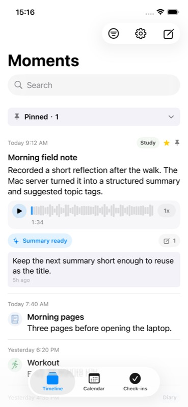
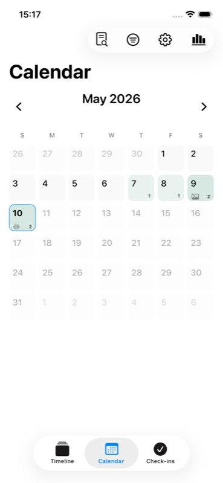
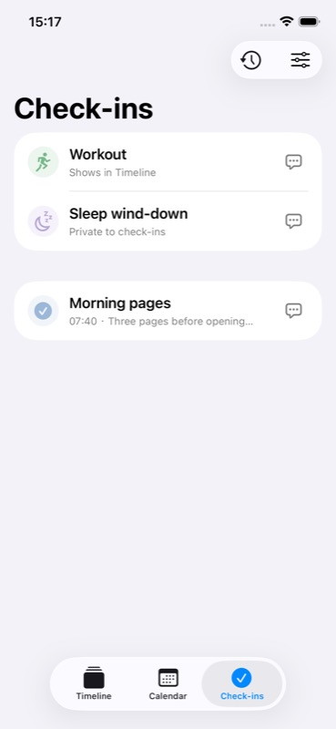

# Private Moments

Private Moments is a private, self-hosted personal timeline for iPhone and Mac.

The iOS app is the main capture and browsing surface. A Mac runs the local server, SQLite archive, media storage, sync API, AI-summary jobs, and a small admin UI. The app is local-first: new moments are saved on the phone immediately, then synced when the Mac server is reachable.

Private Moments is meant for personal archives, not social sharing. It supports text, photos, audio, video, comments, favorites, smart tags, check-ins, calendar review, Share Sheet import, offline retry, media recovery, restic-backed archive backup/restore, and optional server-side AI summaries for uploaded audio/video.

## Screenshots

<p>
  
  
  
</p>

Screenshots are generated from the simulator demo fixture:

```bash
npm run ios:simulator:demo
```

The demo fixture is opt-in and only runs when the app is launched with `--private-moments-demo-data`. It writes deterministic local posts, tags, comments, AI-summary metadata, media placeholders, and check-ins into the simulator database. The normal app path never seeds demo data.

- [PRD](docs/PRD.md)
- [Technical Design](docs/TECH-DESIGN.md)
- [Integration Guide](docs/INTEGRATION-GUIDE.md)
- [Operator Runbook](docs/OPERATOR-RUNBOOK.md)
- [Networking](docs/NETWORKING.md)
- [Workflow](docs/WORKFLOW.md)
- [Handoff](docs/HANDOFF.md)
- [Design Principles](docs/DESIGN-PRINCIPLES.md)
- [Release Checklist](docs/RELEASE-CHECKLIST.md)
- [Open Source Readiness](docs/OPEN-SOURCE-READINESS.md)
- [Market Research](docs/MARKET-RESEARCH.md)

## Development

Recommended local setup:

```bash
npm run setup:local
npm run server:dev
```

Optional setup flags:

```bash
npm run setup:local -- --with-ai
npm run setup:local -- --with-ios
```

`--with-ai` prepares the Mac-local `mlx-whisper` transcription environment. `--with-ios` regenerates the Xcode project with `xcodegen`.

Manual fallback:

```bash
npm install
cp server/.env.example server/.env
npm run server:prisma:generate
npm run server:prisma:deploy
npm run admin:build
npm run server:build
npm run server:dev
```

Before first start, set `PRIVATE_MOMENTS_INITIAL_PASSWORD` in `server/.env`. The setup script keeps an existing `server/.env` unchanged and only creates one from `server/.env.example` when missing. Agents should collect this value with secure secret handling instead of asking users to paste credentials into chat or documentation.

This password is only used to create the first local user when the database has no users.

The server defaults to:

```text
http://127.0.0.1:3210
```

After `npm run admin:build`, the Mac admin UI is served at:

```text
http://127.0.0.1:3210/admin/
```

The Admin `Archive` tab can configure a restic backup repository, create a project-managed `.private-moments-restic-key`, run manual or scheduled daily backups, list/check snapshots, restore a snapshot into a staged directory, and prepare a verified restore for promotion. Routine use should go through Admin rather than raw restic commands; see [Operator Runbook](docs/OPERATOR-RUNBOOK.md) for the repository/key security semantics and recovery steps.

## iOS App

Run the Mac server if needed, build the iOS app, install it into the simulator, and launch it:

```bash
npm run ios:simulator
```

Run the simulator with reusable demo data for screenshots and UI review:

```bash
npm run ios:simulator:demo
```

Install and launch on the paired iPhone:

```bash
npm run ios:device
```

In the app, open Settings, enter the Mac server URL and the initial password, then log in. In the simulator, use `http://127.0.0.1:3210`. On a real iPhone, configure any URL that can reach your Mac server: LAN, Tailscale/private VPN, Cloudflare Tunnel, or another protected HTTPS endpoint. Private Moments does not require a specific networking provider; see [Networking](docs/NETWORKING.md).

For machine-specific device, signing, bundle identifier, App Group, and remote URL settings:

```bash
cp .env.local.example .env.local
```

`npm run ios:simulator` and `npm run ios:device` read `.env.local` and generate an ignored `ios/Config/Local.xcconfig` for local iOS overrides.

The iOS app stores local posts, comments, tags, generated AI summary metadata, pending operations, compressed images, audio/video media, posters, legacy transcript metadata, Share Extension imports, and drafts under the app's Application Support or App Group directories. New audio/video posts do not run iOS speech transcription. Posting does not wait for network success; sync retries when the server is reachable, and failed pending work uses delayed automatic retry. Settings includes Storage & Diagnostics for local iPhone usage, Sync Health, AI summary diagnostics, re-downloadable audio/video cache cleanup, tag management, appearance/language settings, feature module toggles, and Mac server storage when the server is online.

After iOS code changes, rebuild and reinstall to the real device with `npm run ios:device`.

## launchd

Install the Mac login service:

```bash
server/scripts/install-launchd.sh
```

Uninstall it:

```bash
server/scripts/uninstall-launchd.sh
```

The default production data directory is:

```text
~/Library/Application Support/PrivateMoments
```

For local development, set `PRIVATE_MOMENTS_DATA_DIR` to avoid writing to the production directory.

The server soft-deletes posts first, then permanently removes expired deleted posts and media files after 30 days. Cleanup runs once on server startup and then every 6 hours while the service is running.

## Smoke Test

```bash
curl http://127.0.0.1:3210/api/v1/health

curl -X POST http://127.0.0.1:3210/api/v1/auth/login \
  -H 'Content-Type: application/json' \
  -d '{"password":"your-password","deviceName":"Dev iPhone","platform":"ios"}'
```

For route details, admin filters, sync payloads, and media batch download examples, see [Integration Guide](docs/INTEGRATION-GUIDE.md).

## Release And Open Source

This repository is still intended for private/local-first use. Before making it public, complete the checks in [Release Checklist](docs/RELEASE-CHECKLIST.md), [Open Source Readiness](docs/OPEN-SOURCE-READINESS.md), and [Security And Privacy](SECURITY.md).
