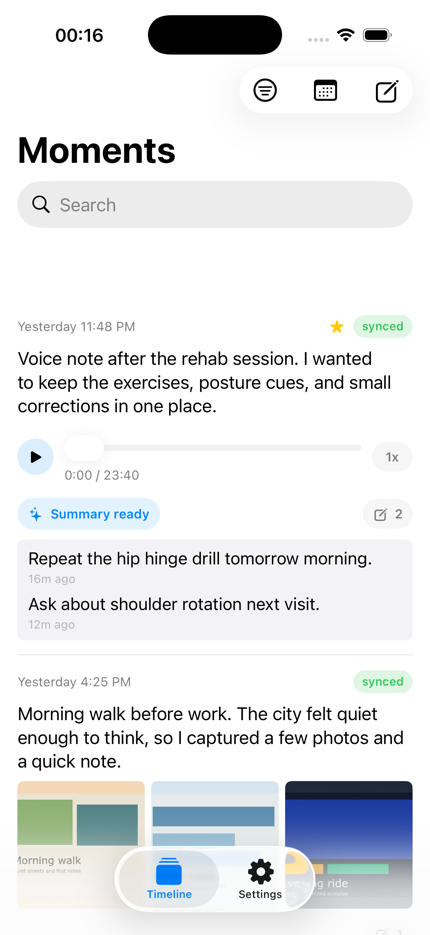
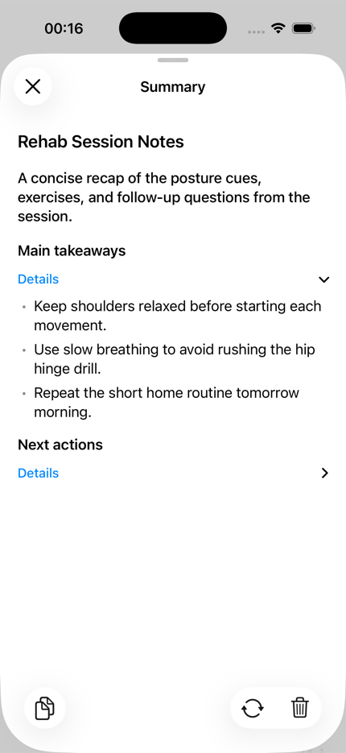
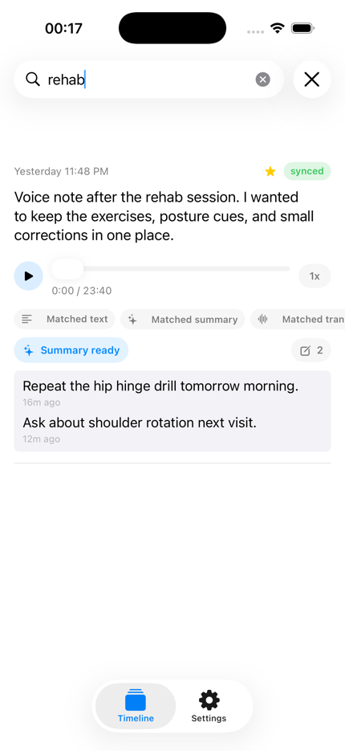
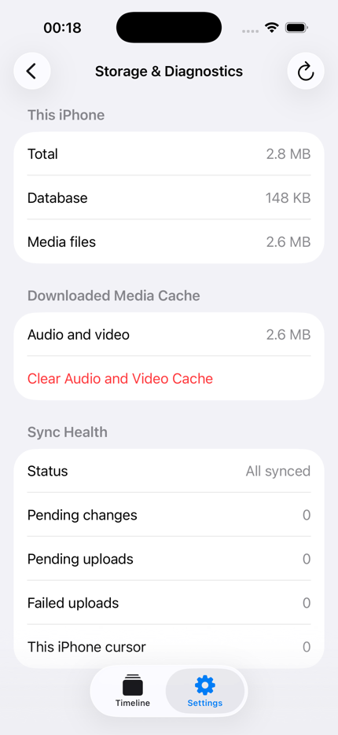
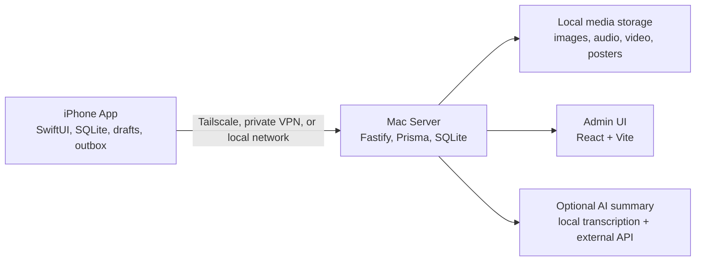

# Private Moments

[English version](README.en.md)

## 一个不需要观众的私人时间线。

Private Moments 是一个 iPhone 优先、Mac 自托管的个人时间线。你可以用它记录文字、照片、语音、短视频，以及那些后来想补在某一段生活下面的私密评论。

它想解决的是一个很日常的问题：写日记太正式，记笔记太分散，发社交平台又总像是在面对别人。Private Moments 保留了“发一条动态”的轻松感，但把所有内容留在你自己的本地优先系统里：iPhone 负责捕捉，Mac 负责归档，你自己负责备份，私有网络负责连接。

没有粉丝。没有点赞压力。没有算法流。没有租来的云端记忆。

只有你的生活片段，安静地留在一个属于你的 feed 里。

## 产品截图

截图内容为 demo 数据，用来展示 iOS 端的核心使用体验。

<table>
  <tr>
    <td width="25%">
      <br>
      <sub>时间线：文字、语音、评论和 AI 摘要入口聚在同一个 feed 里。</sub>
    </td>
    <td width="25%">
      <br>
      <sub>AI Summary：长语音和视频可以生成结构化摘要。</sub>
    </td>
    <td width="25%">
      <br>
      <sub>搜索：按文本、评论、转写和摘要来源定位旧记录。</sub>
    </td>
    <td width="25%">
      <br>
      <sub>诊断：在手机上查看存储、同步和上传状态。</sub>
    </td>
  </tr>
</table>

## 为什么要做这个项目

很多个人记录工具都会滑向两个极端：

- **社交应用**足够顺手，但默认语境是“别人会看到”。
- **日记和知识库应用**足够私密，但经常把生活记录变成写作任务或资料管理。

Private Moments 想站在中间：

- 像发朋友圈一样轻：一句话、一张照片、一段语音、一段短视频都可以成为一条 moment；
- 像日记一样私密：默认没有观众，也不引入公开互动；
- 像信息流一样好回看：可以按时间滚动、搜索、筛选、收藏、跳转月份；
- 像自托管归档一样可控：数据在自己的 Mac 上，备份和迁移都由自己掌握。

一句话概括：**用发布的轻松感捕捉生活，用归档的可靠性保存生活。**

## 它能做什么

- **私人时间线**
  在 iPhone 上发布文字、图片、语音、视频，或者文字加一种媒体，然后像刷 feed 一样回看过去。

- **主界面私密评论**
  可以直接在某条 moment 下补一句评论，类似私人版朋友圈的节奏，但没有作者、点赞、回复、通知或其他人。

- **离线优先发布**
  没网、Mac 不在线、外出途中都可以先发。内容会立即保存在 iPhone 本地，后续再自动同步。

- **Mac 作为长期归档源**
  Mac 运行本地服务，保存 SQLite 数据库、媒体文件、同步状态、日志和 Admin UI。

- **适合生活媒体的体验**
  图片会压缩到更适合长期保存的尺寸，视频有 poster 和时间线静音播放，语音可以像备忘录一样直接录制和回听。

- **长语音/视频的 AI 摘要**
  语音或视频上传到 Mac 后，可以先在 Mac 本地转写，再调用外部 OpenAI-compatible API 生成结构化摘要。iPhone 不保存外部 API key。

- **搜索与整理**
  时间线支持轻量模糊搜索、媒体类型筛选、月份筛选、收藏筛选、评论筛选、待同步筛选，以及命中来源筛选。

- **诊断、恢复和备份**
  App 和 Admin 工具可以查看存储、同步、上传、AI summary 的状态。项目提供本地备份、恢复和 metadata 导出命令。

## 和其他工具有什么不一样

| 对比对象 | Private Moments 的区别 |
| --- | --- |
| 微信朋友圈、Instagram 等社交 feed | 保留“随手发布”的节奏，但去掉观众、算法、点赞、公开评论和平台锁定。 |
| Apple Notes 或 Voice Memos | 把分散的文字、照片、录音、视频收进同一条时间线，而不是散落在不同 App 里。 |
| 日记 App | 不要求每天写完整长文。一句话、一段声音、一个后续评论都可以成立。 |
| 云端 Journal 产品 | 长期归档在自己的 Mac 上，可以用自己的工具备份。 |
| 相册备份工具 | 不只是媒体堆积。每条 moment 可以带文字、评论、发生时间、收藏、搜索和 AI 摘要。 |
| Notion、Obsidian 或知识库系统 | 目标不是搭第二工作区，而是降低记录和回看生活的摩擦。 |

## 当前状态

这个仓库目前是 **v1.0 public-release candidate**。

如果你能接受从源码运行 Mac 服务、用 Xcode 安装 iOS App，它已经可以作为一个本地个人系统使用。它还不是 App Store/TestFlight 产品，也还没有被打包成面向普通用户的一键安装应用。

当前已经包含：

- SwiftUI 原生 iOS App；
- Node.js/Fastify Mac server；
- Prisma + SQLite metadata store；
- 本地媒体文件存储；
- React/Vite Admin UI；
- sync API 和 OpenAPI contract；
- 文字、图片、语音、视频、评论、收藏、筛选和搜索；
- 基于 Mac-local transcription + external summary provider 的 AI media summaries；
- 备份、恢复、导出、诊断和 launchd service 脚本。

## 架构概览



iPhone 是发布和浏览入口。Mac 是归档源、同步节点、媒体仓库、诊断入口和可选 AI worker。

推荐的网络边界是 Tailscale 或其他 private VPN。不要在没有额外生产加固的情况下把 server 直接暴露到公网。

## 快速开始

需要准备：

- macOS；
- Node.js 和 npm；
- Xcode，用于构建 iOS App；
- XcodeGen，用于生成 iOS project；
- 可选：Tailscale 或其他 private VPN，用于真实 iPhone 远程访问 Mac；
- 可选：`mlx-whisper` 环境和一个 OpenAI-compatible API provider，用于 AI summaries。

克隆仓库后：

```bash
npm run setup:local
npm run server:dev
```

server 默认地址：

```text
http://127.0.0.1:3210
```

Admin UI 构建完成后会由 server 提供：

```text
http://127.0.0.1:3210/admin/
```

setup 脚本会创建本地配置、安装依赖、准备 Prisma、应用数据库迁移、构建 Admin UI，并构建 server。

可选 setup 参数：

```bash
npm run setup:local -- --with-ai
npm run setup:local -- --with-ios
```

`--with-ai` 用于准备 Mac-local transcription。`--with-ios` 用于重新生成 iOS project。

## iOS App

运行模拟器：

```bash
npm run ios:simulator
```

安装到已配对的 iPhone：

```bash
PRIVATE_MOMENTS_DEVICE_NAME="Your iPhone" npm run ios:device
```

在 App 里打开 Settings，填入 Mac server URL 和本地 server 配置里的初始密码。

模拟器使用：

```text
http://127.0.0.1:3210
```

真实 iPhone 推荐使用 Mac 的私有网络地址，例如 Tailscale Serve HTTPS 地址，或 Tailscale IP + `3210` 端口。

## AI Summaries

AI summaries 是可选能力。它的流程刻意放在 server 侧：

1. iPhone 把语音或视频上传到 Mac。
2. Mac 在本地把媒体转写成 transcript。
3. Mac 把 transcript 发给你配置的外部 summary API。
4. 结构化 summary 再同步回 iPhone。

这样可以让外部 provider 的 API key 留在 Mac 上，也让转写和总结失败更容易诊断。

provider 通过本地环境变量配置。不要把真实 API key 提交到仓库。

## 备份、恢复和导出

创建本地备份：

```bash
npm run backup:local
```

导出 metadata，用于检查或迁移规划：

```bash
npm run export:local
```

从备份恢复：

```bash
npm run restore:local -- backups/private-moments-backup-YYYYMMDDTHHMMSSZ.tgz --yes
```

backup 用于恢复。metadata export 用于检查，不包含媒体文件。

## 文档

- [产品需求](docs/PRD.md)
- [技术设计](docs/TECH-DESIGN.md)
- [运维手册](docs/OPERATOR-RUNBOOK.md)
- [集成指南](docs/INTEGRATION-GUIDE.md)
- [设计原则](docs/DESIGN-PRINCIPLES.md)
- [工作流](docs/WORKFLOW.md)
- [发布检查清单](docs/RELEASE-CHECKLIST.md)
- [Release Notes](docs/RELEASE-NOTES-v1.0-public-candidate.md)
- [Open Source Readiness](docs/OPEN-SOURCE-READINESS.md)
- [Public Release Track](docs/PUBLIC-RELEASE-TRACK.md)
- [Security And Privacy](SECURITY.md)
- [Contributing](CONTRIBUTING.md)

目前大部分长文档使用中文，因为项目的产品语境和开发过程主要以中文推进。英文版 README 保留在 [README.en.md](README.en.md)，方便英文读者快速评估项目。

## 这个项目不是什么

Private Moments 不是：

- 公开社交网络；
- 多用户协作产品；
- 云端 SaaS 日记；
- 端到端加密聊天工具；
- 完整相册备份软件；
- 已经面向普通用户打包好的 App Store 产品；
- 默认可以直接暴露公网的 server。

这些边界是刻意保留的。这个项目优先服务一个人：一个想要私密、耐久、低摩擦生活时间线的人。

## Roadmap

公开发布前后，比较值得继续做的事情：

- 增加截图或短 demo video；
- 在第二台干净 Mac 上测试 setup flow；
- 增加 GitHub Actions，覆盖 server/admin verification；
- 优化 iOS 首次配置体验；
- 强化生产网络部署指引；
- 继续优化 AI summary 的质量和诊断体验。

## Contributing

公开仓库发布后，欢迎提交 issue 和 pull request。开始前建议先阅读 [Contributing](CONTRIBUTING.md)、[Security And Privacy](SECURITY.md) 和设计原则。

这个项目最重要的产品约束是：主时间线要保持安静。新功能应该改善捕捉、回看、同步或恢复，而不是把 feed 变成后台管理面板。

## License

MIT. See [License](LICENSE).
